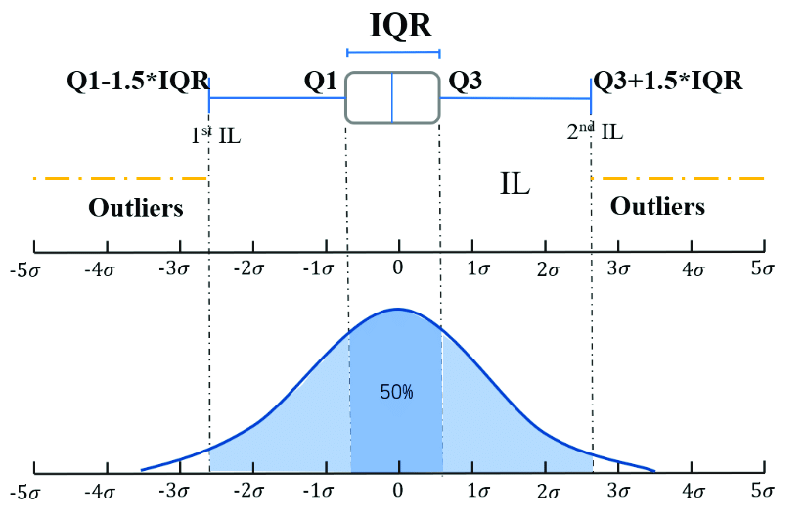
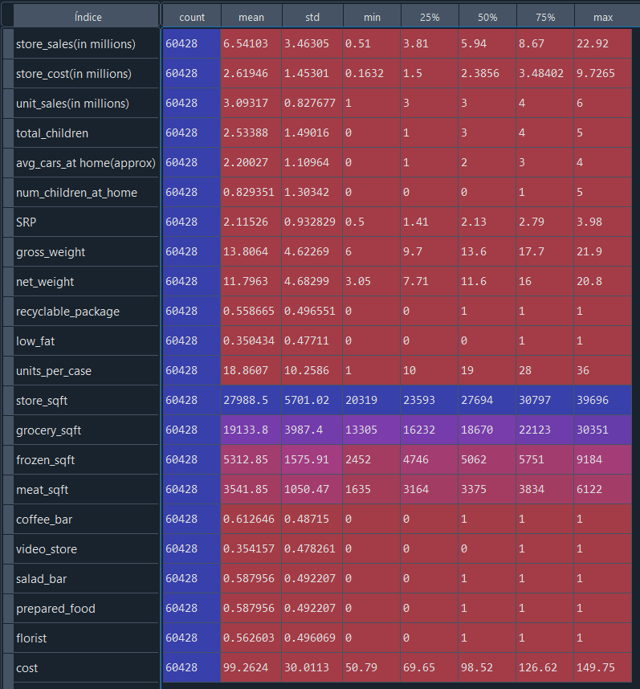
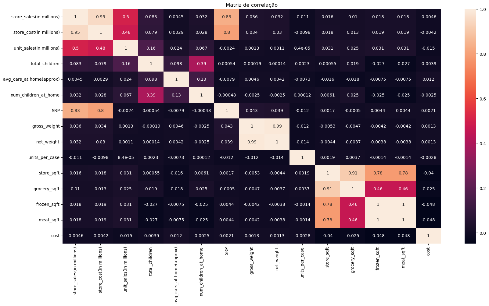
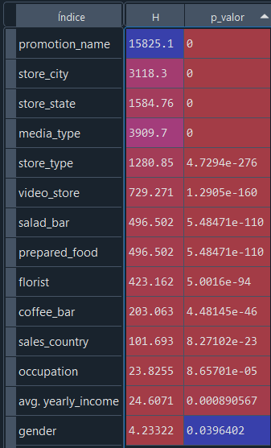
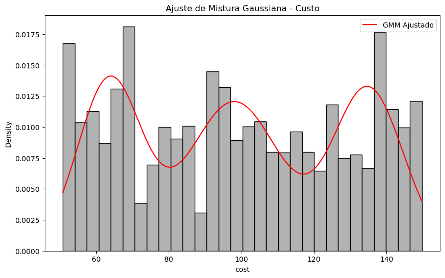
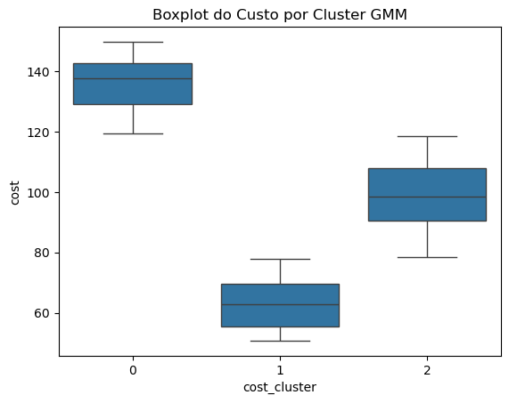
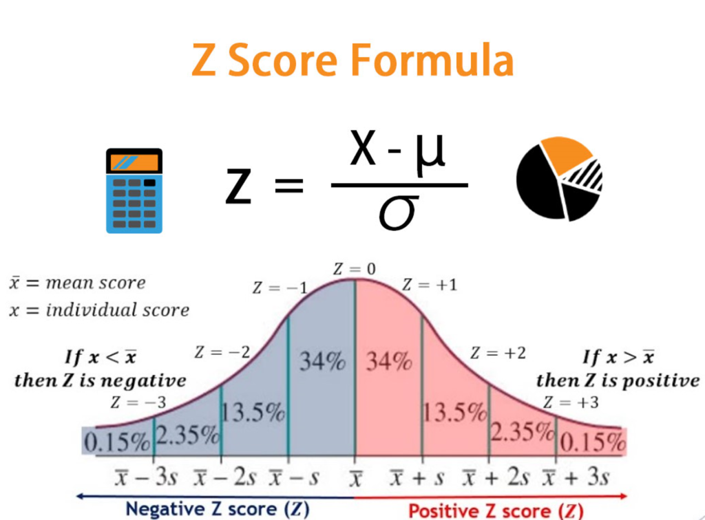

# Análise Exploratória de Dados (EDA): Caso Convenient Food Mart (CFM)

<p align='center'></p>

## Objetivo  
Preparar um relatório para o Grupo Convenient Food Mart (CFM) com uma análise inicial da base de dados de suas promoções. O objetivo é avaliar a qualidade dos dados coletados, identificar possíveis erros e encontrar padrões e relações entre variáveis que possam influenciar o custo de aquisição de clientes e o desempenho das promoções.

---

## Contextualização  
Este projeto tem o objetivo de preparar um relatório para o Grupo Convenient Food Mart (CFM) com uma análise dos dados de suas promoções.  

Como tarefa, preciso identificar possíveis padrões e relações entre variáveis que impactam o custo de aquisição de clientes e o desempenho das promoções. A base de dados contém informações sobre 60 mil clientes, incluindo renda, detalhes das promoções, dados das lojas, desempenho de vendas e custos com mídia. O grupo CFM deseja utilizar essa análise para compreender melhor esses fatores e, no futuro, criar um modelo de previsão para otimizar suas estratégias promocionais.

---

## Perguntas de negócio  
O Grupo Convenient Food Mart (CFM) levantou questões estratégicas para entender os fatores que influenciam o desempenho das promoções e o custo de aquisição de clientes. Essas perguntas foram formuladas com base na revisão de dados históricos, discussões com as equipes de marketing e operações e análise de tendências do mercado:

1. O desempenho das campanhas está associado ao tipo de produto em promoção ou ao tipo de loja em que a promoção ocorre? 
2. O perfil do cliente influencia a participação e o volume de compras promocionais?  
3. As características e a estrutura da loja afetam o desempenho das promoções?  
4. O tipo de mídia e promoção utilizada afetam a eficiência das vendas promocionais?  
5. O custo de aquisição de clientes são é por quais fatores?  
6. Quais variáveis combinadas afetam as vendas promocionais?

---

## Iniciando projeto e explorando dados
Para dar início à análise exploratória, é essencial se familiarizar com o conjunto de dados presente no dataset estudado. Uma ferramenta útil para obter uma visão geral dos dataframes antes de analisá-los é o IDE Spyder, utilizado neste projeto. Ele permite visualizar os dataframes diretamente no ambiente de desenvolvimento assim que são salvos como objetos, facilitando a inspeção inicial dos dados.
<p align='center'></p>

## Explorando dados
1. Verificando dimensões do dataframe: A base de dados possui 60428 observações (linhas) e 40 variáveis (colunas)
```python
df.shape
Out[3]: (60428, 40)
```
2. Identificando variáveis do dataframe:
```python
df.columns
Out[4]: 
Index(['food_category', 'food_department', 'food_family',
       'store_sales(in millions)', 'store_cost(in millions)',
       'unit_sales(in millions)', 'promotion_name', 'sales_country',
       'marital_status', 'gender', 'total_children', 'education',
       'member_card', 'occupation', 'houseowner', 'avg_cars_at home(approx)',
       'avg. yearly_income', 'num_children_at_home',
       'avg_cars_at home(approx).1', 'brand_name', 'SRP', 'gross_weight',
       'net_weight', 'recyclable_package', 'low_fat', 'units_per_case',
       'store_type', 'store_city', 'store_state', 'store_sqft', 'grocery_sqft',
       'frozen_sqft', 'meat_sqft', 'coffee_bar', 'video_store', 'salad_bar',
       'prepared_food', 'florist', 'media_type', 'cost'],
      dtype='object')
```
Nota-se que a coluna 'avg_cars_at home (approx)' está duplicada. Será necessário removê-la:
```python
df = df.drop(columns='avg_cars_at home(approx).1')

df.columns
Out[6]: 
Index(['food_category', 'food_department', 'food_family',
       'store_sales(in millions)', 'store_cost(in millions)',
       'unit_sales(in millions)', 'promotion_name', 'sales_country',
       'marital_status', 'gender', 'total_children', 'education',
       'member_card', 'occupation', 'houseowner', 'avg_cars_at home(approx)',
       'avg. yearly_income', 'num_children_at_home', 'brand_name', 'SRP',
       'gross_weight', 'net_weight', 'recyclable_package', 'low_fat',
       'units_per_case', 'store_type', 'store_city', 'store_state',
       'store_sqft', 'grocery_sqft', 'frozen_sqft', 'meat_sqft', 'coffee_bar',
       'video_store', 'salad_bar', 'prepared_food', 'florist', 'media_type',
       'cost'],
      dtype='object')
```
3. Verificando valores duplicados: Não há nenhum valor duplicado na base de dados.
```python
df.duplicated().sum()
Out[7]: 0
```

4. Verificando dados faltantes: Não há dados faltantes na base de dados.
```python
df.isnull().sum()
Out[8]: 
food_category               0
food_department             0
food_family                 0
store_sales(in millions)    0
store_cost(in millions)     0
unit_sales(in millions)     0
promotion_name              0
sales_country               0
marital_status              0
gender                      0
total_children              0
education                   0
member_card                 0
occupation                  0
houseowner                  0
avg_cars_at home(approx)    0
avg. yearly_income          0
num_children_at_home        0
brand_name                  0
SRP                         0
gross_weight                0
net_weight                  0
recyclable_package          0
low_fat                     0
units_per_case              0
store_type                  0
store_city                  0
store_state                 0
store_sqft                  0
grocery_sqft                0
frozen_sqft                 0
meat_sqft                   0
coffee_bar                  0
video_store                 0
salad_bar                   0
prepared_food               0
florist                     0
media_type                  0
cost                        0
dtype: int64
```

5. Verificando tipo dos dados: Há 17 variáveis categóricas e 22 variáveis quantitativas.
```python

df.info()
<class 'pandas.core.frame.DataFrame'>
RangeIndex: 60428 entries, 0 to 60427
Data columns (total 39 columns):
 #   Column                    Non-Null Count  Dtype  
---  ------                    --------------  -----  
 0   food_category             60428 non-null  object 
 1   food_department           60428 non-null  object 
 2   food_family               60428 non-null  object 
 3   store_sales(in millions)  60428 non-null  float64
 4   store_cost(in millions)   60428 non-null  float64
 5   unit_sales(in millions)   60428 non-null  float64
 6   promotion_name            60428 non-null  object 
 7   sales_country             60428 non-null  object 
 8   marital_status            60428 non-null  object 
 9   gender                    60428 non-null  object 
 10  total_children            60428 non-null  float64
 11  education                 60428 non-null  object 
 12  member_card               60428 non-null  object 
 13  occupation                60428 non-null  object 
 14  houseowner                60428 non-null  object 
 15  avg_cars_at home(approx)  60428 non-null  float64
 16  avg. yearly_income        60428 non-null  object 
 17  num_children_at_home      60428 non-null  float64
 18  brand_name                60428 non-null  object 
 19  SRP                       60428 non-null  float64
 20  gross_weight              60428 non-null  float64
 21  net_weight                60428 non-null  float64
 22  recyclable_package        60428 non-null  float64
 23  low_fat                   60428 non-null  float64
 24  units_per_case            60428 non-null  float64
 25  store_type                60428 non-null  object 
 26  store_city                60428 non-null  object 
 27  store_state               60428 non-null  object 
 28  store_sqft                60428 non-null  float64
 29  grocery_sqft              60428 non-null  float64
 30  frozen_sqft               60428 non-null  float64
 31  meat_sqft                 60428 non-null  float64
 32  coffee_bar                60428 non-null  float64
 33  video_store               60428 non-null  float64
 34  salad_bar                 60428 non-null  float64
 35  prepared_food             60428 non-null  float64
 36  florist                   60428 non-null  float64
 37  media_type                60428 non-null  object 
 38  cost                      60428 non-null  float64
dtypes: float64(22), object(17)
memory usage: 18.0+ MB
```

6. Verificando distribuição dos valores únicos:
```python

df.nunique()
Out[10]: 
food_category                 45
food_department               22
food_family                    3
store_sales(in millions)    1033
store_cost(in millions)     9919
unit_sales(in millions)        6
promotion_name                49
sales_country                  3
marital_status                 2
gender                         2
total_children                 6
education                      5
member_card                    4
occupation                     5
houseowner                     2
avg_cars_at home(approx)       5
avg. yearly_income             8
num_children_at_home           6
brand_name                   111
SRP                          315
gross_weight                 376
net_weight                   332
recyclable_package             2
low_fat                        2
units_per_case                36
store_type                     5
store_city                    19
store_state                   10
store_sqft                    20
grocery_sqft                  20
frozen_sqft                   20
meat_sqft                     20
coffee_bar                     2
video_store                    2
salad_bar                      2
prepared_food                  2
florist                        2
media_type                    13
cost                         328
dtype: int64
```

## Resultados e discussão

Observa-se que não há dados faltantes ou duplicados, o que indica que essa base já passou por um processamento prévio para facilitar a extração de informações. No entanto, apesar de estar aparentemente limpa, foi identificada e removida uma coluna duplicada, reduzindo o número de variáveis de 40 para 39. Com as variáveis qualitativas e quantitativas definidas, podemos agora iniciar sua análise.

---

# Análise Exploratória das Variáveis

Na análise univariada, foi explorada cada variável individualmente para entender sua distribuição, tendência central e dispersão. Já na análise multivariada, foram investigadas as relações entre diferentes variáveis, buscando identificar padrões, correlações e possíveis insights que possam impactar as promoções e o custo de aquisição de clientes.

# Análise Univariada: Variáveis qualitativas

1. Criando um dataframe com as variáveis qualitativas:
```Python
#Variáveis qualitativas
colunas_quali = df.select_dtypes(include=['object']).columns

#Criando dataframe apenas com variáveis qualitativas
df_quali = df.select_dtypes(include=['object'])
```
2. Explorando categorias dentro das variáveis:
```Python

for i in colunas_quali:
    print(f'\n Variável: {i} \n Valores únicos: {df[i].unique()}')

 Variável: food_category 
 Valores únicos: ['Breakfast Foods' 'Bread' 'Canned Shrimp' 'Baking Goods' 'Vegetables'
 'Frozen Desserts' 'Candy' 'Snack Foods' 'Dairy' 'Starchy Foods'
 'Cleaning Supplies' 'Decongestants' 'Meat' 'Hot Beverages'
 'Jams and Jellies' 'Carbonated Beverages' 'Seafood' 'Specialty'
 'Kitchen Products' 'Electrical' 'Beer and Wine' 'Candles' 'Fruit'
 'Pure Juice Beverages' 'Canned Soup' 'Paper Products' 'Canned Tuna'
 'Eggs' 'Hardware' 'Canned Sardines' 'Canned Clams' 'Pain Relievers'
 'Side Dishes' 'Bathroom Products' 'Magazines' 'Frozen Entrees' 'Pizza'
 'Cold Remedies' 'Canned Anchovies' 'Drinks' 'Hygiene' 'Plastic Products'
 'Canned Oysters' 'Packaged Vegetables' 'Miscellaneous']

 Variável: food_department 
 Valores únicos: ['Frozen Foods' 'Baked Goods' 'Canned Foods' 'Baking Goods' 'Produce'
 'Snacks' 'Snack Foods' 'Dairy' 'Starchy Foods' 'Household'
 'Health and Hygiene' 'Meat' 'Beverages' 'Seafood' 'Deli'
 'Alcoholic Beverages' 'Canned Products' 'Eggs' 'Periodicals'
 'Breakfast Foods' 'Checkout' 'Carousel']

 Variável: food_family 
 Valores únicos: ['Food' 'Non-Consumable' 'Drink']

 Variável: promotion_name 
 Valores únicos: ['Bag Stuffers' 'Cash Register Lottery' 'High Roller Savings'
 'Double Down Sale' 'Green Light Days' 'Big Time Savings' 'Price Savers'
 'Price Slashers' 'Dollar Days' 'Two Day Sale' 'Super Duper Savers'
 'Weekend Markdown' 'Dollar Cutters' 'Sales Galore' 'Big Promo'
 'Free For All' 'Savings Galore' 'Unbeatable Price Savers'
 'Price Smashers' 'Shelf Clearing Days' 'Sales Days' 'Go For It'
 'Super Savers' 'Wallet Savers' 'Save-It Sale' 'Price Destroyers'
 'Two for One' 'Big Time Discounts' 'Shelf Emptiers' 'Bye Bye Baby'
 'One Day Sale' 'Fantastic Discounts' 'Saving Days' 'You Save Days'
 'Sale Winners' 'Coupon Spectacular' 'Three for One' 'Price Winners'
 'Dimes Off' 'I Cant Believe It Sale' 'Money Savers' 'Green Light Special'
 'Price Cutters' 'Tip Top Savings' 'Best Savings' 'Pick Your Savings'
 'Double Your Savings' 'Mystery Sale' 'Super Wallet Savers']

 Variável: sales_country 
 Valores únicos: ['USA' 'Mexico' 'Canada']

 Variável: marital_status 
 Valores únicos: ['M' 'S']

 Variável: gender 
 Valores únicos: ['F' 'M']

 Variável: education 
 Valores únicos: ['Partial High School' 'Bachelors Degree' 'High School Degree'
 'Graduate Degree' 'Partial College']

 Variável: member_card 
 Valores únicos: ['Normal' 'Silver' 'Bronze' 'Golden']

 Variável: occupation 
 Valores únicos: ['Skilled Manual' 'Professional' 'Manual' 'Management' 'Clerical']

 Variável: houseowner 
 Valores únicos: ['Y' 'N']

 Variável: avg. yearly_income 
 Valores únicos: ['$10K - $30K' '$50K - $70K' '$30K - $50K' '$70K - $90K' '$110K - $130K'
 '$130K - $150K' '$150K +' '$90K - $110K']

 Variável: brand_name 
 Valores únicos: ['Carrington' 'Golden' 'Imagine' 'Big Time' 'PigTail' 'Fantastic' 'Great'
 'Sphinx' 'Modell' 'Colony' 'Blue Label' 'Pleasant' 'Bravo' 'Better'
 'Just Right' 'Plato' 'BBB Best' 'Landslide' 'Super' 'CDR' 'High Top'
 'Tri-State' 'Hermanos' 'Tell Tale' 'Ebony' 'Thresher' 'Gulf Coast'
 'Musial' 'Atomic' 'Choice' 'Fort West' 'Nationeel' 'Horatio'
 'Best Choice' 'Fast' 'Gorilla' 'Carlson' 'Even Better' 'Club' 'Booker'
 'Shady Lake' 'Monarch' 'Discover' 'Colossal' 'Medalist' 'Jardon'
 'Cormorant' 'Sunset' 'Red Wing' 'High Quality' 'Denny' 'Faux Products'
 'Steady' 'Consolidated' 'Bird Call' 'Hilltop' 'Ship Shape' 'Footnote'
 'Genteel' 'Quick' 'Gerolli' 'Excellent' 'Fabulous' 'Token' 'Skinner'
 'Washington' 'Dual City' 'Kiwi' 'Tip Top' 'Amigo' 'Curlew' 'Moms'
 'Cutting Edge' 'Red Spade' 'Lake' 'American' 'Walrus' 'Pearl' 'Good'
 'Top Measure' 'Portsmouth' 'Toucan' 'Applause' 'Swell' 'Green Ribbon'
 'Big City' 'National' 'Blue Medal' 'Urban' 'Jumbo' 'Giant' 'Dollar'
 'Mighty Good' 'Robust' 'Gauss' 'Excel' 'Radius' 'Best' 'Jeffers'
 'Johnson' 'Special' 'Akron' 'Framton' 'Black Tie' 'Queen' 'James Bay'
 'Toretti' 'Prelude' 'Symphony' 'ADJ' 'King']

 Variável: store_type 
 Valores únicos: ['Deluxe Supermarket' 'Supermarket' 'Gourmet Supermarket' 'Small Grocery'
 'Mid-Size Grocery']

 Variável: store_city 
 Valores únicos: ['Salem' 'Tacoma' 'Seattle' 'Spokane' 'Los Angeles' 'Beverly Hills'
 'Portland' 'Bellingham' 'Orizaba' 'Merida' 'Hidalgo' 'Mexico City'
 'Vancouver' 'Bremerton' 'Camacho' 'Guadalajara' 'Acapulco'
 'San Francisco' 'Victoria']

 Variável: store_state 
 Valores únicos: ['OR' 'WA' 'CA' 'Veracruz' 'Yucatan' 'Zacatecas' 'DF' 'BC' 'Jalisco'
 'Guerrero']

 Variável: media_type 
 Valores únicos: ['Daily Paper, Radio' 'In-Store Coupon' 'Radio' 'Daily Paper'
 'Product Attachment' 'Sunday Paper, Radio' 'Sunday Paper, Radio, TV'
 'Sunday Paper' 'Street Handout' 'TV' 'Bulk Mail' 'Cash Register Handout'
 'Daily Paper, Radio, TV']
```
3. Explorando distribuição e frequência das categorias dentro das variáveis:
```Python
#Análise das variáveis qualitativas: Frequência absoluta
for variavel in df_quali:
    #ordena variáveis em ordem decrescente
    ordem = df_quali[variavel].value_counts().index
    plt.Figure(figsize=(20,10))
    sns.countplot(x=df_quali[variavel], order=ordem)
    plt.title(f'Frequência Absoluta - {variavel}')
    plt.xlabel(xlabel=f'{variavel}')
    plt.ylabel('Frequência')
    plt.xticks(rotation=90)
    plt.tight_layout()
    plt.show()    
```
A distribuição das categorias nas variáveis qualitativas revelou as seguintes frequências:
<p align='center'>


</p>

## Resultados e discussão

Após a avaliação inicial da distribuição das variáveis, algumas tendências chamaram atenção, especialmente em relação ao impacto das promoções em diferentes perfis de clientes, categorias de produtos e tipos de loja. Para entender melhor esses padrões, foram realizadas análises segmentadas, permitindo identificar quais grupos respondem melhor às estratégias promocionais e onde há oportunidades de otimização. A seguir, serão apresentados os principais insights extraídos dessas análises.

1. Categorias de alimento mais vendidas em promoção
<p align='center'> </p>
       
As categorias Vegetables, Snack Foods e Dairy lideram as vendas promocionais, representando juntas mais de 30% do total. Isso sugere que itens básicos e de alto consumo diário respondem melhor a campanhas promocionais. Em contrapartida, categorias como Packaged Staples e Canned Sardines apresentam baixa adesão às promoções, indicando menor impacto dos descontos nesses segmentos.

2. Distribuição das vendas em promoção por tipo de cliente
<p align='center'> </p>

Clientes com cartão Bronze são os que mais compram produtos promocionais, representando 55,95% das vendas nessa categoria. Esse dado sugere que clientes com menor fidelidade ao programa de benefícios podem ser mais sensíveis a descontos. Já clientes Golden e Silver, que teoricamente têm maior engajamento, participam menos das promoções, o que pode indicar que suas compras não dependem tanto de incentivos promocionais.

3. Distribuição das vendas em promoção por escolaridade do cliente
<p align='center'> </p>

A participação nas promoções é maior entre clientes com ensino médio completo ou incompleto, representando juntos cerca de 60% das vendas promocionais. Já clientes com ensino superior completo (Graduate Degree) apresentam a menor adesão às promoções (5,15%), sugerindo que esse grupo pode ser menos sensível a descontos diretos. Essa tendência pode indicar que promoções voltadas para clientes de maior escolaridade precisam de abordagens diferenciadas, como benefícios agregados ou programas de fidelidade.

4. Distribuição das vendas em promoção por renda do cliente
<p align='center'> </p>

Clientes com renda entre $30K e $50K são os mais propensos a comprar produtos em promoção, seguidos pelos que ganham entre $10K e $30K. Isso indica que consumidores de baixa e média renda têm maior sensibilidade a descontos. Já os clientes com renda acima de $90K apresentam baixa participação, sugerindo que estratégias promocionais para esse público podem precisar de abordagens diferentes, como exclusividade e benefícios não monetários.

5. Distribuição das vendas em promoção por tipo de loja
<p align='center'> </p>

A maior parte das vendas promocionais ocorre em supermercados tradicionais (43,34%) e deluxe supermarkets (37,99%), indicando que esses formatos de loja são os mais propensos a oferecer e impulsionar promoções. Já Gourmet Supermarkets possuem uma participação muito menor (10,76%), o que pode indicar que clientes desses estabelecimentos são menos sensíveis a descontos diretos. Pequenos mercados (Mid-Size Grocery e Small Grocery) representam uma fatia marginal das vendas promocionais, sugerindo que promoções nesses locais podem precisar de estratégias diferenciadas para aumentar a adesão.

# Análise Univariada: Variáveis quantitativas

1. Criando um dataframe com as variáveis quantitativas:
```Python
#Variáveis quantitativas
colunas_quant = df.select_dtypes(include = np.number).columns

#Criando dataframe apenas com variáveis quantitativas
df_quant = df.select_dtypes(include = np.number)
```
2. Identificando e tratando outliers:

O método utilizado para a limpeza de outliers foi o método IQR (Interquartile Range), conforme ilustrado abaixo.
<p align='center'> </p>

Aplicando o método:
```Python
#Criando função para remover outliers usando IQR
def remove_outliers(dataframe):
    for variavel in dataframe:
        #calculando IQR
        Q1 = dataframe[variavel].quantile(0.25)
        Q3 = dataframe[variavel].quantile(0.75)
        IQR = Q3 - Q1
        limite_sup = Q3 + 1.5*IQR
        limite_inf = Q1 - 1.5*IQR
        #criando array para definir posição dos outliers
        array_sup = dataframe[dataframe[variavel] >= limite_sup].index
        array_inf =dataframe[dataframe[variavel] <= limite_inf].index
        #removendo outliers
        dataframe = dataframe.drop(index=array_sup).drop(index=array_inf)
    return dataframe

#chamando função que remove outliers pelo método IQR
df_quant = remove_outliers(df_quant)
```
3. Explorando distribuições dos dados quantitativos:
```Python
#Exploração inicial dos dados quantitativos
dados_colunas_quant = df.select_dtypes(exclude=['object']).describe().T
```
<p align='center'> </p>

4. Visualização da distribuição das variáveis quantitativas:
```Python
for variavel in df_quant:
    plt.Figure(figsize=(20,10))
    sns.displot(x=df_quant[variavel], kde= True)
    plt.title(f'Distribuição de valores - {variavel}')
    plt.xlabel(xlabel=f'{variavel}')
    plt.ylabel('Contagem')
    plt.xticks(rotation=90)
    plt.tight_layout()
    plt.show()
    plt.boxplot(df_quant[variavel], vert=False)
    plt.title(f'Boxplot - {variavel}')
    plt.ylabel('Amostra')
    plt.xlabel('Valor')
    plt.show()
```
A distribuição das variáveis quantitativas revelou os seguintes padrões estatísticos (clique na imagem para ampliado): 
<p align='center'>
    
    
    
    
    
    
    
    
    
    
    
    
    
    
    
    
    
    
    
    
    
    
    
    
    
    
    
    
    
    
    
    
    
    
    
    
    
    
    
    
    
    
    
    
</p>

Durante a análise exploratória, foram identificadas variáveis originalmente categóricas que haviam sido convertidas para valores binários (0 e 1), como low_fat, recyclable_package, coffee_bar, video_store, salad_bar, prepared_food e florist. Essa identificação foi possível por meio da distribuição dessas variáveis nos histogramas, que apresentaram dois picos bem definidos, característicos de dados binários. Embora a codificação numérica seja útil para determinadas modelagens estatísticas, foi realizada a reconversão dessas variáveis para sua forma original ("Sim"/"Não"). Essa reformulação permitirá uma análise complementar focada na relação dessas variáveis qualitativas com outros fatores, como desempenho das promoções.

5. Explorando variáveis qualitativas adicionais:

Uma vez identificadas variáveis qualitativas adicionais, conforme explorado na análise anterior, foi possível analisar a distruibuição e frequência das categorias dessas variáveis no dataset.

```Python
#Algumas variáveis sofreram o problema de ponderação arbitrária
#passando variáveis quanti para quali

df_quali_adicionais = df_quant[['recyclable_package', 'low_fat', 'coffee_bar', 'video_store','salad_bar','prepared_food','florist']]
df_quali_adicionais = df_quali_adicionais.replace({0: 'Não', 1: 'Sim'})

for variavel in df_quali_adicionais:
    freq_rel = pd.crosstab(index=df_quali_adicionais[variavel], columns='Porcentagem', normalize=True).sort_values('Porcentagem' ,ascending = False)
    freq_rel['Porcentagem'] = (freq_rel['Porcentagem']*100).round(2)
    #configurando e gerando plot em barras
    ax5 = sns.barplot(data=freq_rel,x=variavel,y='Porcentagem',hue='Porcentagem',palette='rocket')
    ax5.set_box_aspect(1/3)
    for container in ax5.containers: ax5.bar_label(container, fmt='%.2f',padding = 3,fontsize=8)
    plt.Figure(figsize=(20,6), dpi = 20)
    plt.title(f'Frequência - {variavel}', fontsize=10)
    plt.xlabel('Categorias', fontsize=8)
    plt.ylabel('Porcentagem', fontsize=8)
    plt.xticks(fontsize=6)
    plt.yticks(fontsize=6)
    plt.legend(title="Porcentagem", fontsize=5, title_fontsize=12, loc="upper right")
    plt.show()
```
<p align='center'>


</p>

## Resultados e discussão

A variável cost apresenta uma distribuição sem um padrão bem definido, caracterizada por múltiplos picos, o que sugere a influência de diferentes fatores na sua variação. O boxplot confirma a ausência significativa de outliers,resultado do tratamento feito nos dados, mas evidencia uma ampla dispersão dos valores, indicando que o custo de aquisição de clientes varia substancialmente entre campanhas ou perfis de consumidores. Essa análise será essencial para identificar correlações com variáveis como tipo de loja, promoção e características do público, permitindo compreender melhor os determinantes desse custo.

# Análise multivariada: Variáveis quantitativas x variáveis quantitativas

Para a análise multivariada entre variáveis quantitativas, foi aplicada a matriz de correlação utilizando o coeficiente de Pearson.

```Python
#Análise Quanti x Quanti
plt.figure(figsize = (20,10))
sns.heatmap(df_quant.corr(), annot= True)
plt.title('Matriz de correlação')
plt.show()
```
<p align='center'></p>

## Resultados e discussão

A variável cost, o custo de aquisição de cliente, não apresenta correlação significativa com nenhuma outra variável quantitativa.  Essa ausência de correlação sugere que cost pode ser influenciado por variáveis categóricas, conforme será verificado na próxima etapa da análise.

# Análise multivariada: Variáveis quantitativas x variáveis qualitativa (ANOVA)

Para a análise da relação do custo de aquisição de clientes, foi utilizado o teste de Kruskal-Wallis em vez da ANOVA por não exigir que os dados sigam uma distribuição normal ou que as variâncias entre os grupos sejam homogêneas. Com essa análise, será possível identificar se há diferenças estatisticamente significativas no custo de aquisição em função das variáveis categóricas.

```Python
import pandas as pd
from scipy.stats import kruskal

#Criando um dicionário para armazenar os resultados
kruskal_resultados = {}

#aplicando o teste de Kruskal-Wallis para cada variável qualitativa em relação ao custo
for var in colunas_quali:
    #Criando os grupos de "cost" para cada categoria na variável categórica
    grupos = [df[df[var] == categoria]["cost"] for categoria in df[var].unique()]
    print(grupos)
    H, p_valor = kruskal(*grupos)
    kruskal_resultados[var] = {"H": H, "p_valor": p_valor}

#Criando um DataFrame para visualizar os resultados
kruskal_df = pd.DataFrame.from_dict(kruskal_resultados, orient='index')

#salvando variaveis significativas
kruskal_significativo = kruskal_df[kruskal_df['p_valor']<=0.05]
```
<p align='center'>

</p>

Os gráficos a seguir mostram a distribuição do custo de aquisição de clientes para as variáveis categóricas que mostraram diferenças significativas no teste de Kruskal-Wallis. A visualização em boxplot destaca a dispersão e a mediana dos grupos. (Clique na imagem para ampliá-la).

```Python
for variavel in colunas_kruskal:
    plt.figure(figsize=(10, 5))
    sns.boxplot(x=df[variavel], y=df['cost'], palette='coolwarm')
    plt.title(f'Distribuição do Custo por {variavel} (Violino)')
    plt.ylabel('Custo')
    plt.xlabel(variavel)
    plt.xticks(rotation=90)
    plt.show()
```

<p align='center'>
    
    
    
    
    
    
    
    
    
    
    
    
    
    
</p>

## Resultados e discussão

Os gráficos mostram como o custo de aquisição varia entre diferentes variáveis categóricas, revelando diferenças significativas entre os grupos. No entanto, a alta dispersão dos valores dentro de algumas variáveis qualitativas pode dificultar a identificação de padrões mais claros. Para entender melhor essas variações, a próxima etapa da análise será focada na segmentação dos custos em clusters, permitindo agrupar faixas de valores semelhantes e identificar como diferentes variáveis qualitativas, como tipo de mídia e promoção aplicada, estão associadas a cada nível de custo.

# Análise multivariada: Clusterização do custo de aquisição de cliente

Para segmentar os custos, foi utilizado o modelo Gaussian Mixture Model (GMM), que agrupa valores semelhantes sem assumir uma distribuição fixa. 

```Python
from sklearn.mixture import GaussianMixture
import numpy as np

#Ajustando um modelo GMM na distribuição de 'cost'
cost_values = df["cost"].values.reshape(-1, 1)
gmm = GaussianMixture(n_components=3, random_state=42).fit(cost_values)

#Gerando pontos para plotar a distribuição ajustada
x = np.linspace(df["cost"].min(), df["cost"].max(), 1000)
densidade = np.exp(gmm.score_samples(x.reshape(-1, 1)))
```

O gráfico a seguir compara a distribuição real do custo com o ajuste feito pelo GMM, permitindo visualizar como os clusters foram formados. Isso facilita a análise da relação entre os níveis de custo e as variáveis qualitativas.

```Python
#Plotando a distribuição real e a ajustada pelo GMM
plt.figure(figsize=(10,6))
sns.histplot(df["cost"], bins=30, color="gray", kde=False, stat="density", alpha=0.6)
plt.plot(x, densidade, color="red", label="GMM Ajustado")
plt.title("Ajuste de Mistura Gaussiana - Custo")
plt.legend()
plt.show()

df["cluster_custo"] = gmm.predict(df["cost"].values.reshape(-1, 1))

#Distribuição de custo por cluster identificado
sns.boxplot(x="cost_cluster", y="cost", data=df)
plt.title("Boxplot do Custo por Cluster GMM")
plt.show()
```
<p align='center'>
    
    
</p>

Os cluster foram categorizados como sendo de custo de aquisição de cliente 'Baixo' (para o cluste 1), 'Alto' (para o cluster 0) e 'Médio' (para o cluster 2):
```Python
df["cluster_custo"] = df["cluster_custo"].replace({0: 'Custo Alto', 1: 'Custo Baixo', 2: 'Custo Médio'})
```

## Resultados e discussão

A aplicação do GMM ao custo de aquisição permitiu identificar três clusters com padrões distintos de distribuição. O agrupamento revelou assimetrias não captadas pelas análises descritivas, destacando um grupo concentrado com baixos custos e outro com dispersão elevada. Essa segmentação oferece uma base robusta para explorar como variáveis qualitativas influenciam os diferentes perfis de custo

# Análise do impacto de variáveis qualitativas no custo de aquisição de clientes

Para verificar a associação entre variáveis qualitativas e os clusters de custo, foi aplicado o teste qui-quadrado em tabelas de contingência que cruzam cada variável com os grupos “Custo Baixo”, “Custo Médio” e “Custo Alto”. As variáveis com p-valor ≤ 0,05 foram consideradas significativamente relacionadas ao custo de aquisição.

```Python
import scipy.stats as stats

#Analisando comportamento das variáveis com impacto no CAC por faixa de custo

#Criando um dicionário para armazenar os resultados
resultados_chi2 = {}

# Verificando se variáveis possuem associação com classe de custo
for var in colunas_kruskal:
    #criando tabela d contigência
    contingencia = pd.crosstab(df["cluster_custo"], df[var])
    # Aplicar teste qui-quadrado
    chi2, p_valor, dof, esperado = stats.chi2_contingency(contingencia)
    resultados_chi2[var] = {"chi2": chi2, "p_valor": p_valor}

#Criando um DataFrame para visualizar os resultados
chi2_df = pd.DataFrame.from_dict(resultados_chi2, orient='index')
chi2_significativo = chi2_df[chi2_df['p_valor']<=0.05]

#salvando variáveis significativas
colunas_chi2 = chi2_significativo.index
```
Para as variáveis com impacto significativo no custo de aquisição de clientes geraram-se gráficos de linha mostrando, em porcentagem, como cada categoria distribui clientes faixas de custo alto, médio e baixo. O objetivo será identificar categorias associadas a altas porcentagens de clientes de alto ou baixo custo.

```Python
#faixas de custo
custos = ["Custo Baixo", "Custo Médio", "Custo Alto"]
dic_cor = {"Custo Baixo": "green", "Custo Médio": "orange", "Custo Alto": "red"}

#Criando visualização das associações

for var in colunas_chi2:
    #criando tabela de contigência
    contingencia = pd.crosstab(df["cluster_custo"], df[var]).T
    #normalizando valores
    contingencia = contingencia.div(contingencia.sum(axis=1), axis=0) * 100
    for custo in custos:
        contingencia = contingencia.sort_values(by=custo, ascending = False)
         #Gráfico 1: Linha mostrando variação da porcentagem do cluster "Baixo" por promotion_name
        plt.figure(figsize=(14, 6))
        plt.plot(contingencia.index, contingencia[custo], marker="o", linestyle="-", color=dic_cor[custo], label=f"Cluster {custo}")
        plt.title(f"Percentual da faixa de {custo} do total de clientes por {var}")
        plt.ylabel("Percentual (%)")
        plt.xticks(rotation=90)
        plt.legend()
        plt.grid(True)
        plt.show()
```
<p align='center'>
    
    
    
    
    
    
    
    
    
    
    
    
    
    
    
    
    
    
    
    
    
    
    
    
    
    
    
    
    
    
    
    
    
    
    
    
    
    
    
</p>

## Resultados e discussão

Esta seção de análise revelou que determinadas promoções, formatos de loja e perfis de cliente concentram mais clientes em faixas específicas de custo, o que permitirá direcionar ações de marketing e ajustar campanhas para reduzir ou otimizar o investimento em aquisição de clientes.
Dentre os principais achados, temos que clientes de renda mais baixa concentram-se no “Custo Baixo”, enquanto perfis de renda e escolaridade mais elevados (graduados e pós-graduados) aparecem nos clusters “Custo Médio” e “Custo Alto”, refletindo maior investimento para converter esses públicos. Promoções em mídia digital e e-mail marketing atraem clientes com custo de aquisição menor, ao passo que campanhas multicanal elevam esse custo, e formatos como “dois por um” e “desconto fixo” atendem principalmente ao grupo de custo intermediário. No programa de fidelidade, titulares de cartão Bronze predominam no “Custo Baixo”, Silver no “Custo Médio” e Gold no “Custo Alto”, sugerindo que clientes mais engajados exigem benefícios adicionais, aumentando o investimento para sua aquisição.

# Índice de Eficiência de Custo por Categoria

Para identificar categorias com participação acima ou abaixo da média nos clusters “Custo Baixo” e “Custo Alto”, foi calculado um Z-Score que compara o percentual de cada categoria em um cluster com a média e desvio padrão desse mesmo cluster. 
<p align='center'>
    
</p>
Primeiro, foi construída uma tabela de contingência normalizada para cada variável qualitativa significativa (p ≤ 0,05) e, em seguida, para cada categoria, o percentual foi subtraído da média do cluster e dividido pelo desvio padrão. O gráfico resultante mostra, em verde, a categoria mais eficiente no cluster “Custo Baixo” e, em vermelho, a mais concentrada em “Custo Alto”.

```Python
import scipy.stats as stats
import matplotlib.pyplot as plt

# Para cada variável significativa, criar Z-Score por categoria e plotar
for var in colunas_chi2:
    # Tabela de contingência normalizada (percentual)
    cont = pd.crosstab(df["cluster_custo"], df[var]).T
    cont = cont.div(cont.sum(axis=1), axis=0) * 100

    # Média e desvio por cluster
    mean = cont.mean()
    std = cont.std()

    # Cálculo do Z-Score para “Custo Baixo” e “Custo Alto”
    cont["Z_Baixo"] = (cont["Custo Baixo"] - mean["Custo Baixo"]) / std["Custo Baixo"]
    cont["Z_Alto"] = (cont["Custo Alto"] - mean["Custo Alto"]) / std["Custo Alto"]
    cont = cont.sort_values(by="Z_Baixo", ascending=False)

    # Plot do Z-Score
    plt.figure(figsize=(12, 5))
    plt.plot(cont.index, cont["Z_Baixo"], marker="o", color="green", label="Z – Custo Baixo")
    plt.plot(cont.index, cont["Z_Alto"], marker="o", color="red", label="Z – Custo Alto")
    plt.xticks(rotation=90)
    plt.ylabel("Z-Score")
    plt.title(f"Z-Score por Categoria de {var}")
    plt.legend()
    plt.grid(True)
    plt.show()
```
