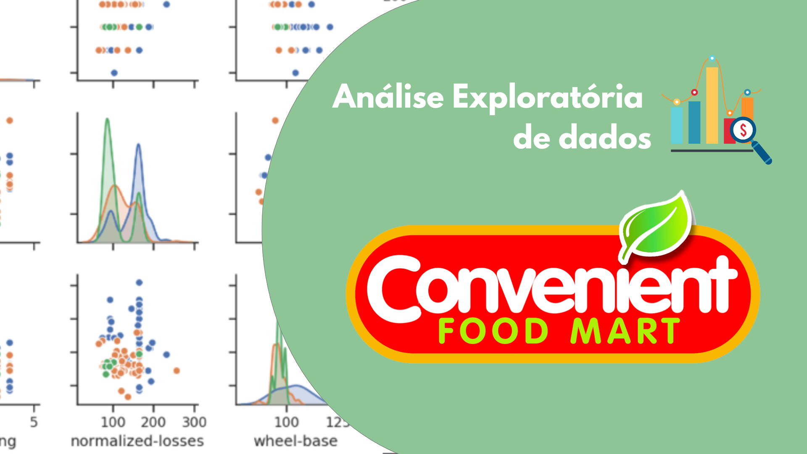
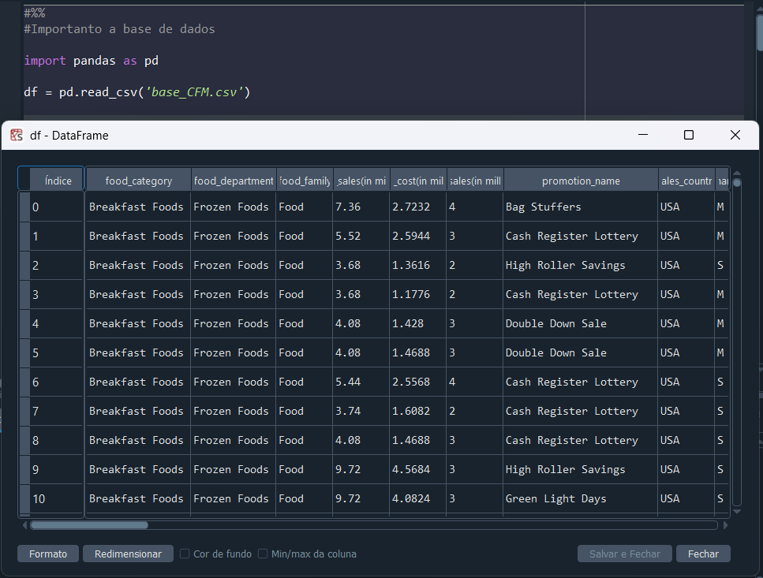

# Análise Exploratória de Dados (EDA): Caso Convenient Food Mart (CFM)

<p align='center'></p>

## Objetivo  
Preparar um relatório para o Grupo Convenient Food Mart (CFM) com uma análise inicial da base de dados de suas promoções. O objetivo é avaliar a qualidade dos dados coletados, identificar possíveis erros e encontrar padrões e relações entre variáveis que possam influenciar o custo de aquisição de clientes e o desempenho das promoções.

---

## Contextualização  
Este projeto tem o objetivo de preparar um relatório para o Grupo Convenient Food Mart (CFM) com uma análise dos dados de suas promoções.  

Como tarefa, preciso identificar possíveis padrões e relações entre variáveis que impactam o custo de aquisição de clientes e o desempenho das promoções. A base de dados contém informações sobre 60 mil clientes, incluindo renda, detalhes das promoções, dados das lojas, desempenho de vendas e custos com mídia. O grupo CFM deseja utilizar essa análise para compreender melhor esses fatores e, no futuro, criar um modelo de previsão para otimizar suas estratégias promocionais.

---

## Perguntas de negócio  
O Grupo Convenient Food Mart (CFM) levantou questões estratégicas para entender os fatores que influenciam o desempenho das promoções e o custo de aquisição de clientes. Essas perguntas foram formuladas com base na revisão de dados históricos, discussões com as equipes de marketing e operações e análise de tendências do mercado:

1. O desempenho das campanhas está associado ao tipo de produto em promoção ou ao tipo de loja em que a promoção ocorre? 
2. O perfil do cliente influencia a participação e o volume de compras promocionais?  
3. As características e a estrutura da loja afetam o desempenho das promoções?  
4. O tipo de mídia e promoção utilizada afetam a eficiência das vendas promocionais?  
5. O custo de aquisição de clientes são é por quais fatores?  
6. Quais variáveis combinadas afetam as vendas promocionais?

---

## Iniciando projeto e explorando dados
Para dar início à análise exploratória, é essencial se familiarizar com o conjunto de dados presente no dataset estudado. Uma ferramenta útil para obter uma visão geral dos dataframes antes de analisá-los é o IDE Spyder, utilizado neste projeto. Ele permite visualizar os dataframes diretamente no ambiente de desenvolvimento assim que são salvos como objetos, facilitando a inspeção inicial dos dados.
<p align='center'></p>

## Explorando dados
1. Verificando dimensões do dataframe: A base de dados possui 60428 observações (linhas) e 40 variáveis (colunas)
```python
df.shape
Out[3]: (60428, 40)
```
2. Identificando variáveis do dataframe:
```python
df.columns
Out[4]: 
Index(['food_category', 'food_department', 'food_family',
       'store_sales(in millions)', 'store_cost(in millions)',
       'unit_sales(in millions)', 'promotion_name', 'sales_country',
       'marital_status', 'gender', 'total_children', 'education',
       'member_card', 'occupation', 'houseowner', 'avg_cars_at home(approx)',
       'avg. yearly_income', 'num_children_at_home',
       'avg_cars_at home(approx).1', 'brand_name', 'SRP', 'gross_weight',
       'net_weight', 'recyclable_package', 'low_fat', 'units_per_case',
       'store_type', 'store_city', 'store_state', 'store_sqft', 'grocery_sqft',
       'frozen_sqft', 'meat_sqft', 'coffee_bar', 'video_store', 'salad_bar',
       'prepared_food', 'florist', 'media_type', 'cost'],
      dtype='object')
```
Nota-se que a coluna 'avg_cars_at home (approx)' está duplicada. Será necessário removê-la:
```python
df = df.drop(columns='avg_cars_at home(approx).1')

df.columns
Out[6]: 
Index(['food_category', 'food_department', 'food_family',
       'store_sales(in millions)', 'store_cost(in millions)',
       'unit_sales(in millions)', 'promotion_name', 'sales_country',
       'marital_status', 'gender', 'total_children', 'education',
       'member_card', 'occupation', 'houseowner', 'avg_cars_at home(approx)',
       'avg. yearly_income', 'num_children_at_home', 'brand_name', 'SRP',
       'gross_weight', 'net_weight', 'recyclable_package', 'low_fat',
       'units_per_case', 'store_type', 'store_city', 'store_state',
       'store_sqft', 'grocery_sqft', 'frozen_sqft', 'meat_sqft', 'coffee_bar',
       'video_store', 'salad_bar', 'prepared_food', 'florist', 'media_type',
       'cost'],
      dtype='object')
```
3. Verificando valores duplicados: Não há nenhum valor duplicado na base de dados.
```python
df.duplicated().sum()
Out[7]: 0
```

4. Verificando dados faltantes: Não há dados faltantes na base de dados.
```python
df.isnull().sum()
Out[8]: 
food_category               0
food_department             0
food_family                 0
store_sales(in millions)    0
store_cost(in millions)     0
unit_sales(in millions)     0
promotion_name              0
sales_country               0
marital_status              0
gender                      0
total_children              0
education                   0
member_card                 0
occupation                  0
houseowner                  0
avg_cars_at home(approx)    0
avg. yearly_income          0
num_children_at_home        0
brand_name                  0
SRP                         0
gross_weight                0
net_weight                  0
recyclable_package          0
low_fat                     0
units_per_case              0
store_type                  0
store_city                  0
store_state                 0
store_sqft                  0
grocery_sqft                0
frozen_sqft                 0
meat_sqft                   0
coffee_bar                  0
video_store                 0
salad_bar                   0
prepared_food               0
florist                     0
media_type                  0
cost                        0
dtype: int64
```

5. Verificando tipo dos dados: Há 17 variáveis categóricas e 22 variáveis quantitativas.
```python

df.info()
<class 'pandas.core.frame.DataFrame'>
RangeIndex: 60428 entries, 0 to 60427
Data columns (total 39 columns):
 #   Column                    Non-Null Count  Dtype  
---  ------                    --------------  -----  
 0   food_category             60428 non-null  object 
 1   food_department           60428 non-null  object 
 2   food_family               60428 non-null  object 
 3   store_sales(in millions)  60428 non-null  float64
 4   store_cost(in millions)   60428 non-null  float64
 5   unit_sales(in millions)   60428 non-null  float64
 6   promotion_name            60428 non-null  object 
 7   sales_country             60428 non-null  object 
 8   marital_status            60428 non-null  object 
 9   gender                    60428 non-null  object 
 10  total_children            60428 non-null  float64
 11  education                 60428 non-null  object 
 12  member_card               60428 non-null  object 
 13  occupation                60428 non-null  object 
 14  houseowner                60428 non-null  object 
 15  avg_cars_at home(approx)  60428 non-null  float64
 16  avg. yearly_income        60428 non-null  object 
 17  num_children_at_home      60428 non-null  float64
 18  brand_name                60428 non-null  object 
 19  SRP                       60428 non-null  float64
 20  gross_weight              60428 non-null  float64
 21  net_weight                60428 non-null  float64
 22  recyclable_package        60428 non-null  float64
 23  low_fat                   60428 non-null  float64
 24  units_per_case            60428 non-null  float64
 25  store_type                60428 non-null  object 
 26  store_city                60428 non-null  object 
 27  store_state               60428 non-null  object 
 28  store_sqft                60428 non-null  float64
 29  grocery_sqft              60428 non-null  float64
 30  frozen_sqft               60428 non-null  float64
 31  meat_sqft                 60428 non-null  float64
 32  coffee_bar                60428 non-null  float64
 33  video_store               60428 non-null  float64
 34  salad_bar                 60428 non-null  float64
 35  prepared_food             60428 non-null  float64
 36  florist                   60428 non-null  float64
 37  media_type                60428 non-null  object 
 38  cost                      60428 non-null  float64
dtypes: float64(22), object(17)
memory usage: 18.0+ MB
```

6. Verificando distribuição dos valores únicos:
```python

df.nunique()
Out[10]: 
food_category                 45
food_department               22
food_family                    3
store_sales(in millions)    1033
store_cost(in millions)     9919
unit_sales(in millions)        6
promotion_name                49
sales_country                  3
marital_status                 2
gender                         2
total_children                 6
education                      5
member_card                    4
occupation                     5
houseowner                     2
avg_cars_at home(approx)       5
avg. yearly_income             8
num_children_at_home           6
brand_name                   111
SRP                          315
gross_weight                 376
net_weight                   332
recyclable_package             2
low_fat                        2
units_per_case                36
store_type                     5
store_city                    19
store_state                   10
store_sqft                    20
grocery_sqft                  20
frozen_sqft                   20
meat_sqft                     20
coffee_bar                     2
video_store                    2
salad_bar                      2
prepared_food                  2
florist                        2
media_type                    13
cost                         328
dtype: int64
```

## Resultados e discussão

Observa-se que não há dados faltantes ou duplicados, o que indica que essa base já passou por um processamento prévio para facilitar a extração de informações. No entanto, apesar de estar aparentemente limpa, foi identificada e removida uma coluna duplicada, reduzindo o número de variáveis de 40 para 39. Com as variáveis qualitativas e quantitativas definidas, podemos agora iniciar sua análise.
